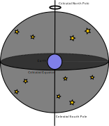
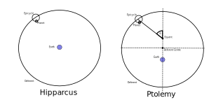
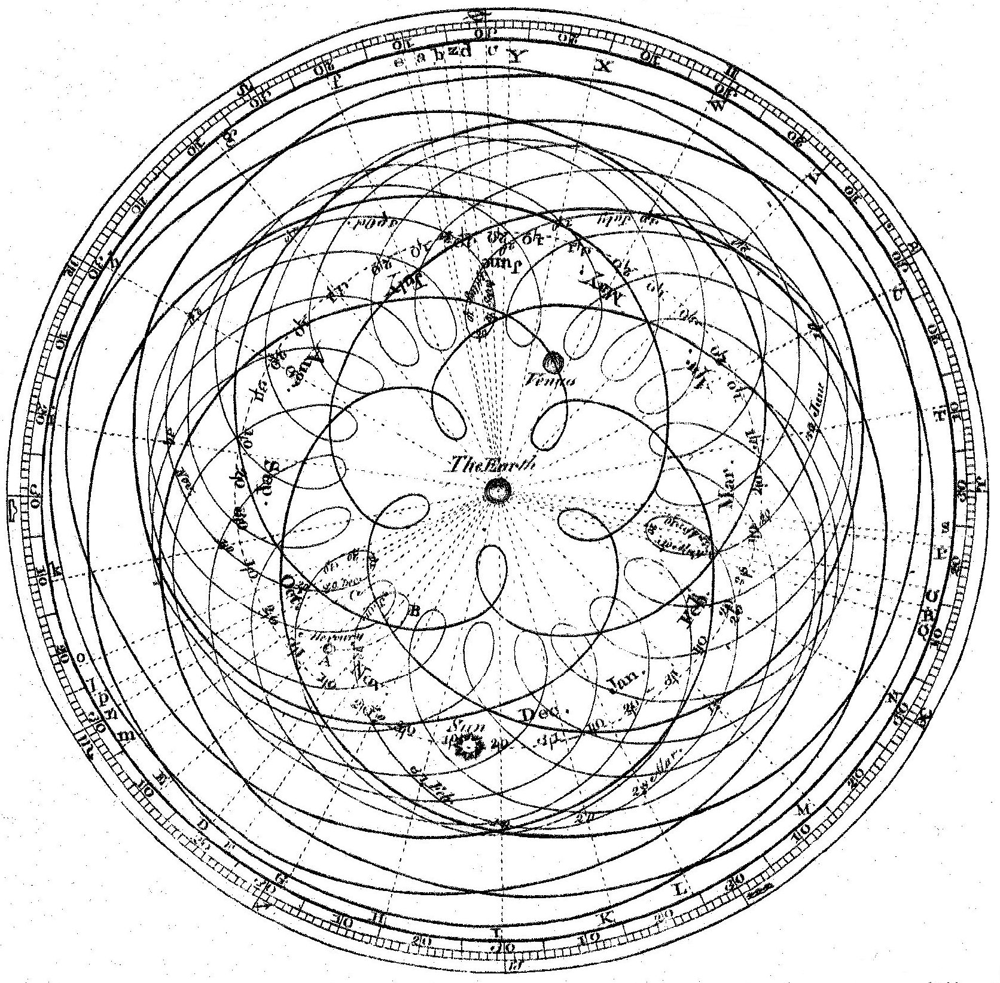
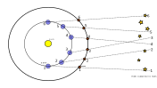
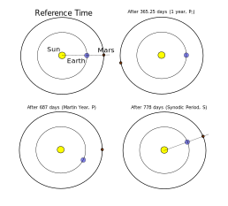

# PY3109: Observational Astrophysics

**Module Objective:** To provide students with an overview of observational astrophysics.

**Module Content**: Magnitude brightness scale, optical telescopes, introduction to radio, IR, UV, X-ray astronomy, Hertzsprung-Russell diagram, stellar spectra & classification, variable and binary stars.

**Learning Outcomes**: On successful completion of this module, students should be able to:
1. Perform simple numerical calculations covering a wide range of astronomical topics, including magnitude brightness scale, radio, IR, UV and X-ray astronomy.
2. Explain the theory of star formation, stellar atmospheres and stellar structure.
3. Apply stellar structure theory to white dwarfs and neutron stars.
4. Demonstrate the ability to perform astronomical observations and gather astronomical data.

**Assessment**: Total Marks 100: Formal Written Examination 80 marks; Continuous Assessment 20 marks (10 assignments, 2 marks each).
# Section 1: The Coordinate System
**Relevant Literature**: Chapter 1 of Ryden & Peterson

**Key Question**
How do we convey the positions of stars in the night sky to people who are observing from a different place on the Earths surface, or who live at different time to us (and make sense of observations taken thousands of years ago)? Defining a coordinate system which accounts for the tilt and precession of the Earths spin axis relative to the Sun-Earth orbital plane is non-trivial, and in order to understand it, we must go back to the ancient Greeks.

## The evolution of the solar systems geometry - Geocentrism
Humans have a long history of studying the position of stars in the night sky. One of the oldest models is the geocentric model, proposed by Plato. In this model, the Earth lies at the centre of everything, and the stars and planets are on a celestial sphere which is rotating around us. There are a few useful definitions which come from this projection which we still use today. The projection of the Earth's equator onto the sphere is the **celestial equator**, while the projection of the poles onto the night sky gives us the **celestial poles**.

This model works well at explaining the diurnal (daily) motion of stars, but the "wandering stars", or planets, could not be. These planets would slowly move West to East with respect to the fixed background stars, but would occasionally reverse direction before reverting back to West to East. An example of this movement is shown below for Venus.

Hipparchus proposed a slight augmentation to Plato's model to explain the retrograde motion of these planets. This model involved a system of circles. For any given planet, it rotated on an **epicycle** which in turn rotated on a larger **deferent** as below. This still didn't agree with the motion of the planets adequately, which led Ptolemy to augment the model by offsetting the Earth from the centre of the deferent and adding an **equant**. The planet still orbits the deferent centre, but it's assumed that 

$$
\frac{d\theta}{dt}
$$

is constant, which allows for a circular orbit to give the same observed effects as a body which is following an elliptical orbit. While still not perfect at predicting the motions of the planets, it could easily be adapted to new observations by adding in new circles.

While these models were incredibly precise at predicting the positions of stars, the requirement to constantly add new circles to explain the complex motion of the planets suggested that something was wrong with them. One of the final versions of this model is shown below, and really hammers home how complicated the model had to be in order to explain the motion of *just Venus and Mercury*.

However, it was a hard model to refute - the strongest reason being that stellar parallax was not observed by ancient/medieval astronomers. There are two reasons why this would be true - 1 is that the Earth is stationary, the other is that the stars are too far away for the parallax to be measured. For the second scenario, ancient astronomers had very accurate measurements of stellar positions, and concluded that for the stars to be far enough way that stellar parallax wouldn't be observed would mean there's a lot of empty space between stars - and this made them so uneasy that they couldn't bring themselves to believe it.

## The evolution of the solar systems geometry - Heliocentrism
It took until the 15th century to move away from this geocentric view of the solar system, when Nicolaus Copernicus proposed a heliocentric model of the planets. One immediate consequence of this was that the maximum angular distance of both Venus ($47^{\rm o}$) and Mercury ($28^{\rm o}$) from the Sun meant that they had to lie within Earth's orbit, and that Mercury had to lie closest to the Sun.

The Copernican model of the Solar system could easily account for the retrograde motion of the planets, which was a major failing of any geocentric models. An example of how the sudden reversals in a planets direction of motion across the night sky is shown in the below Figure. The numbers indicate different observing times, starting from 1 and ending at 6. Between observation 3 and 4, Mars undergoes a "reversal" in the night sky.

Heliocentrism also allows us to calculate the **true** (sidereal) orbital periods of the planets. Consider a planet which is further from Earth than the Sun. Conjunctions occur when all planets and the Sun lie on a straight line connecting their centres. In the below, when the Earth lies between the Sun and Mars, is called **opposition**. The time between successive oppositions is S, the synodic period. The sidereal period of the planet, P, can then be calculated using

$$
\begin{align}
\frac{1}{P_{\rm S}} &= \frac{1}{P_\oplus}-\frac{1}{P} (P>P_\oplus)\\ 
\frac{1}{P_{\rm S}} &= \frac{1}{P}-\frac{1}{P_\oplus} (P<P_\oplus)
\end{align}
$$
where $P_\oplus$ is the Earth's period of 365.256308 days. Once P has been determined, Kepler's laws can then be used the separation between the Sun and the planet.

While elegant in explaining the motion of the planets, the heliocentric model was as accurate as the geocentric model when it came to predicting the positions of bodies in the night sky - mainly because Copernicus still required  that planets orbit in perfect circles. Epi-cycles were introduced into the Copernican model in order to have the predicted observations match positions.

It wasn't until Kepler derived his laws and incorporated eccentricities into the orbits of planets that the accuracy of positions increased by several orders of magnitudes, helping solidify the heliocentric model as the correct model.