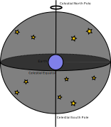
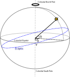
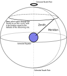
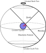
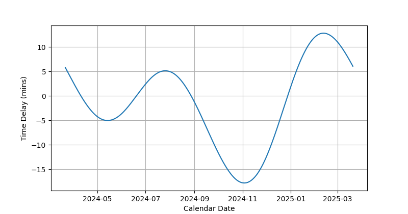

# Positional Astronomy

> [!abstract] Key Question
> How are we to decipher the information on [pages like this](https://simbad.cds.unistra.fr/simbad/sim-basic?Ident=PSR+J1023%2B0038&submit=SIMBAD+search) and how do we quickly determine whether or not the systems are visible from our observing site?

Now that we've explored the various models for the solar system, and convinced ourselves that the Heliocentric model is the way to go, let's discuss positional astronomy - that is, assigning co-ordinates to objects which are understandable from various locations on the Earths surface and at different times. There are several things we need to account for, such as the rotation of the Earth, the orbit of the Earth around the Sun, and the precession of the Earths axis.  To start, we're going to use a geocentric frame as shown below.

In this coordinate system, due to the Earths tilt of 23.5 degrees relative to the orbital plane, the sun follows a path throughout the year known as the **ecliptic**. Below I show the position of the sun on the celestial sphere when viewed from Earth throughout the year. Note that the x-axis is inverted. This is because RA is measured Eastwards from the vernal equinox.

So, for any given object, its position on the sky is given as:
> [!info] The Equatorial Co-ordinate System
> - **Declination** ($\delta$) with respect to the celestial equator (equivalent to "Latitude")
> - **Right Ascension** ($\alpha$) with respect to the Spring Equinox $\gamma$ (equivalent to "Longitude"), and measured in the anti-clockwise (Eastwards) direction.

This is known as the equatorial coordinate system, with Right Ascension measured eastwards from the location of the vernal equinox ($\gamma$). This system is independent of the rotation of the Earth.

Declination is measured in degrees ($^{\rm{o}}$), minutes('), and seconds(") of arc, and goes between $-90^{\rm{o}}\leq \delta \leq 90^{\rm{o}}$, with negative declination meaning the object is below the celestial equator.

Right ascension is a bit more complicated and is typically given in either degrees, or more commonly as a time, and is given in hour angle (hr), minute (min), and seconds. $\alpha= 0 {\rm \:hr\:} 0 {\rm \:min\:} 0 {\rm \:sec\:}$ corresponds to $\gamma$, while $\alpha= 12 {\rm \:hr\:} 0 {\rm \:min\:} 0 {\rm \:sec\:}$ corresponds to $180^{\rm{o}}$ away from $\gamma$.
## Observing from the Earths Surface
### Declination
Consider an observer standing on the surface of the Earth. The point directly above the observer is known as the zenith, and the line which joins the North celestial pole with the celestial equator that passes directly over head is known as the meridian. Stars are easiest to observe as they pass through the Meridian, as at that point in time, there is a minimum in the atmospheric depth the starlight must pass through to reach the observer.

Also, any star whose declination matches the latitude of the observing site will pass through the Zenith. So, for Cork (a latitude of 52$^{o}$), any star that has a declination of +52$^{o}$ will be directly overhead at some stage during the day/night. 

The observing site also sets a relative horizon for the observer. Consider the image below (where we've moved the observer to the limb of the Earth for ease of drawing). The observer is at a latitude of $\theta$. Any star which has a declination greater $\delta > 90^{o}-\theta$ will never set below the observers horizon (meaning they're always visible), while any star with a declination less than ($\delta<-90^{o}+\theta$) will never rise (meaning they're never visible). Note that these equations only apply as is for observing sites with positive latitudes - if you're observing site has a negative latitude (is in the Southern hemisphere) you'll need to multiply by -1. The best way to get familiar with this is to practice.

>[!example] Example: Distance from Sirius to the Zenith
>What is the minimum angular distance between Sirius and the zenith as viewed from Cork (latitude 52$^{o}$)? What altitude above the horizon will it be at this time?
>Sirius is (approximately) located at 
>- $\alpha$ = 06 hr 45 min
>- $\delta$ = -16$^{o}$ 42'
>
>It will therefore be closest to the zenith when passing through the meridian ($\Delta\alpha$=0). At this time, the angle between the zenith and Sirius will be $52^{o}-(-16^{o} 42')=68^{o} 42'$. Since the angle between the zenith and the horizon is $90^{o}$, then the altitude of Sirius will be $90^{o}-68^{o} 42'=21^{o} 18'$.

>[!example] Example: Is $\alpha$-Cru every visible from Cork? If not, what is the minimum angle below the horizon it reaches?
$\alpha$-Cru is (approximately) located at 
> - $\alpha$ = 12 hr 26 min
> - $\delta$ = -63$^{o}$ 05'
>
>Stars with an declination of $\delta< - 90^{\rm o}+52=-38$ degrees are never visible from Cork. The minimum angle $\alpha$-Cru reaches is $-63+38=-25$ degrees.
### Right Ascension (Time)
#### Sidereal Day
As a species, we have defined a day as the time it takes for consecutive passes of the Sun through the same point of the sky. This takes 24 hours, and is called a Solar (civil) day. In the last lecture, we found that the relationship between the synodic period (S) and the sidereal period (P) is given by:

$$
\begin{align}
\frac{1}{P_{\rm S}} &= \frac{1}{P_\oplus}-\frac{1}{P} (P>P_\oplus)\\ 
\frac{1}{P_{\rm S}} &= \frac{1}{P}-\frac{1}{P_\oplus} (P<P_\oplus)
\end{align}
$$

As we can now see, this means what we're measuring is **not** the true rotation period of the Sun, but is the Earth's synodic rotation period. To see this more clearly, look at the below diagram. Between consecutive passes of the Sun through the same spot on the sky, the Earth has moved in its orbit and has rotated ~361$^{\rm o}$. As such, we can use the above equation to solve for the true period of the Earth. Here, $P_{\rm S}=24 \: {\rm hr}$. So, using the second equation (as the period we are interested in is less than 1 year), we find that P = 23 hours and 56 minutes. This is a **sidereal day**.

So a civil day (from now on, just referred to as day) lasts for 24 hours. However, the sidereal day lasts for 23 hours and 56 minutes. This means stars will rise and set 4 minutes earlier every day.  and, as stars move across the night sky, telescopes must track them at the sidereal rate.

We now define the right ascension of an object ($\alpha$) as the anti-clockwise angle to $\gamma$ in previous diagrams. $\gamma$, which corresponds to an angle of $0^{\rm o}$, is taken to be the position of the Sun on the Vernal equinox, which will occur at 2026-03-20 14:46 this year. This date has always been important in religions. For example, Easter is the first Sunday after the first full moon after the Spring equinox. Irish monks played an important role in developing the "Computus", which calculated the date of Easter with respect to the equinox.

**Back of the envelope calculations**
The sun passes through the meridian at noon on the vernal equinox. As such, any other star which lies on the meridian at noon from Greenwich has $\alpha=0$ hrs. Furthermore, roughly 12 hours later(at midnight) any star lying on the meridian as observed from Greenwich will have $\alpha=12$ hrs. This is the ideal time to observe a source with $\alpha=12$, as it is at it's closest point to the zenith, minimising the atmospheric effects which hinder observations. Note that this is not exact, since the equinox doesn't occur exactly at midday, and in reality stars with a $\alpha=12$ hrs will be overhead 11hrs 56mins later due to the differences between civil and sidereal time. But the above does in a pinch (or in an exam).

One month later (towards the end of April), stars which are passing through the meridian at midnight will have a difference in right ascension of
$$
  \alpha=\frac{4 {\rm min}}{60 {\rm min}}\times30+12 {\rm hr}=14 {\rm hr}
$$

It's also important to note that when a star is on the meridian from Greenwich (longitude of 0$^o$), it **is not** from other observing sites. Take Cork (longitude=8.5$^{o}$ West) as an example. A star will pass through our meridian
$$
    \frac{8.5}{360}\times24\times60=34 \: {\rm min}
$$
later than when it passed through the meridian from Greenwich.

**Exercise: Work out this difference between Dublin and Cork.**
## Equation of Time
Consider again the position of the Sun on the celestial sphere. If we used a sundial to measure the time, and we also kept a watch with us, what would the difference between this times look like? If the orbit of the Earth were perfectly circular and the rotational axis of the Earth was perpendicular to the orbital plane, it should always be 0.

However, our orbit is elliptical and the Earth's rotational axis is not perpendicular to the orbital plane (obliquity). As such, the time between transits (Apparent Solar Time) is different to the time measured using a stop watch (Mean Solar Time), as shown in the plot below. This correction is known as the Equation of Time. This means if you were timing your days using the Sun, the current time you measure would be faster in June and November than if you used a stopwatch, and slower in January and August.
