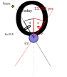
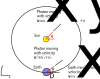
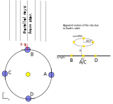

> [!abstract] Key Question
>Now that we can position stars on the celestial sphere, what effects do we need to account for?

# Effects on celestial positions/brightness
## Precession of the Earth's rotational axis
#### Reference Epochs
While this system is independent of the rotation of the Earth because we are defining everything relative to a fixed point ($\gamma$, the location at which the ecliptic intersects the celestial equator at the spring equinox), it is **not** independent of the precession of the Earth's axis.

The Earth's rotational axis precesses around its orbital axis with a period of 26,000 years, with the angle between the rotational axis and orbital axis being 23.6$^{\rm o}$. This causes a very slow shift in the positions of the stars, and is one of the reasons a reference epoch for coordinates is specified.

Consider the diagram below. Right now, the Celestial North Pole is pointing approximately towards Polaris. However, in 13,000 years, the NCP will be pointing away from Polaris, meaning it will no longer be the North star.



So, we must specify an epoch which the coordinates are correct for. The most common epoch is the J2000 epoch, which uses a reference date of noon at Greenwich on January 1 2000. When an object coordinates are given with this epoch, they can then be precessed to match the current observation date. The other common reference epoch is B1950, which is midnight on January 1, 1950.
### Reference Times

The time at which an astronomical event (a supernova, an eclipse, a gamma-ray burst) usually occurs is typically given in Julian days (JD). This is the time which has lapsed, in days, since noon at Greenwich on January 1, 4713 BC. There are variants such as the Modified Julian Date (MJD), which is the time in days since midnight, November 17 1858. MJD is typically used instead of JD simply because it removes a very large constant. 

The JD/MJD can be calculated using the following code snipper
```python
from astropy.time import Time
from datetime import datetime

#ut = Time(datetime.utcnow(), scale='utc')
ut = Time(datetime(2026,1,20,11,0,0,0), scale='utc')

print(f"The current time is: {ut.isot}")
print(f"The current time in JD is: {ut.jd}")
print(f"The current time in MJD is: {ut.mjd}")
```

The current time is: 2026-01-20T11:00:00.000
The current time in JD is: 2461060.9583333335
The current time in MJD is: 61060.458333333336
# Annual Aberration
Consider a star which is on the ecliptic, and we wish to point a telescope at this star in order to observe it. If we were in a stationary reference frame (standing on the surface of the Sun), then we would have to point our telescope at an angle of 

$$
\tan\theta=\frac{u_{\rm y}}{u_{\rm x}}
$$

where $u_{\rm y}$ is the velocity component of the photon coming from the star in the y-direction, and $u_{\rm x}$ in the x-direction. Fortunately, we are not standing on the surface of the Sun, we are safely standing on Earth, which moves with velocity **v**=$v_{\rm x}+v_{\rm y}$.



In the primed frame, the photon will have velocity components $u'_{\rm x} = u_{\rm x}+v_{\rm x}$ and $u'_{\rm y} = u_{\rm y}+u_{\rm y}$. As such, the angle the telescope will need to be pointed at, $\phi$, is
$$
\tan \phi=\frac{u_{\rm y}+v_{\rm y}}{u_{\rm x}+v_{\rm x}}=\frac{\sin \theta +v_{\rm y}/c}{\cos \theta+v_{\rm x}/c}
$$
Now take the extreme example where $\theta=90^{\rm o}$, and the Earth is moving with velocity v=30 km/s in the x direction. The above expression becomes
$$
\tan \phi=\frac{c}{v}
$$
The difference between $\theta$ and $\phi$ (that is, the offset we need to include when pointing our telescope) is then
$$
\tan(\theta-\phi)=\frac{v}{c}
$$
The Earth's velocity is $v= \textbf{v}=30$ km/s, and so the telescope must point with an angle offset of 20.6".

Now consider this effect over one year. When the velocity of Earth is perpendicular to the incoming star light (points D and B), we see a maximum of this effect, while when the velocity is parallel to the photon's velocity, we see no effect (A/C). This means over the year, the star moves along a line on the ecliptic with a maximum displacement of 41.2".




Stars off the ecliptic by an angle $\theta$ become more complex to deal with, and at maximum gain an additional angular component perpendicular to the ecliptic, causing them to trace out ellipses in the night sky. Stars at 90 degrees to  the ecliptic trace out a circle.

Our treatment above is purely classical, but suffices for our purposes. The full treatment requires special relativity, and this annual aberration caused significant confusion up until special relativity was proposed ([I highly recommend reading the wikipedia article on this if you're interested, but it's not necessary for the course](https://en.wikipedia.org/wiki/Aberration_(astronomy))).

