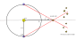
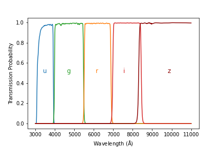

# Proper Motion
Next, we consider the effects of a stars proper motion across the night sky. Consider an observer, and a star with velocity **v** as shown below. In spherical coordinates, this velocity has two components - a radial component, $v_{\rm r}$, and an angular component $v_{\rm \theta}$. If we're tracking a stars position across the celestial sphere, then we are only measuring $v_{\rm \theta}$, which is known as the **transverse velocity**. Now, consider a time interval $\Delta t$. Over this time, an object will have moved a distance $\Delta d$ relative to our line of sight
$$
 \Delta d = v_{\rm \theta} \Delta t.
$$
If the distance, r, to the object is known, then the angular change across the celestial sphere is given by
$$
 \Delta \theta = \frac{\Delta d}{r} = \frac{v_{\rm \theta} \Delta t}{r}.
$$
The **proper motion** of an object, that is the change of this angle with time, is then given by
$$
 \mu \equiv \frac{d \theta}{d t} = \frac{v_{\rm \theta}}{r}.
$$

So, in practice, what is the expression for $\theta$? Consider a star which moves between point A and B on the celestial sphere, as shown below.

First, we can write the expression:
$$
    \frac{\sin{\Delta\theta}}{\sin{\Delta\alpha}} = \frac{\sin(90^{\rm o}-(\delta+\Delta\delta))}{\sin{\phi}}
$$
This result relies on knowing what the law of sines is for arcs on a great circle, which I encourage you to look up in your own time.

This can  be rewritten as 
$$
    \sin\Delta\alpha \cos(\delta+\Delta\delta) = \sin\Delta\theta \sin\phi.
$$
Now using the small angle approximation for anything with $\Delta$ in it (which is likely true for objects moving across the night sky!), we get
$$
    \Delta\alpha \cos(\delta+\Delta\delta) = \Delta\theta \sin\phi.
$$
$\cos(\delta+\Delta\delta)$ can be Taylor expanded around $\Delta\delta\sim0$ to give
$$
    \cos(\delta+\Delta\delta) = \cos(\delta)-\Delta\delta\sin(\delta)+... \approx \cos(\delta)
$$
which then leaves us with 
$$
    \Delta\alpha = \Delta\theta \frac{\sin\phi}{\cos(\delta)}.
$$
Now, in order to solve for $\Delta\theta$ and remove $\phi$, we need to use the law of cosines:
$$
\cos[90^{\rm o}-(\delta+\Delta\delta)]=\cos(90^{\rm o}-\delta)\cos(\Delta\theta)+\sin(90^{\rm o}-\delta)\sin(\Delta\theta)\cos(\phi)
$$
Again, this is for arcs on a great circle, which you may need to look over.

By substituting $\cos[90^{\rm o}-(\delta+\Delta\delta)]=\sin(\delta+\Delta\delta)=\sin(\delta)\cos(\Delta\delta)+\cos(\delta)\sin(\Delta\delta)$ and using the small angle approximation becomes
$$
    \Delta\delta=\Delta\theta\cos\phi
$$
Cominbing this with the equation above gives
$$
    (\Delta\theta)^2=(\Delta\delta)^2+(\Delta\alpha\cos\delta)^2
$$
This gives a very handy expression for calculating the angular separation between two objects.

# Distances, Magnitudes, and the Hertzsprung-Russell Diagram
>[!info] How do we measure the distances to stars, and define how bright stars are? Once we know these parameters, what can they tell us about the structure of our Galaxy, and the hierarchy of stars?

Note that this is nearly a perfect repeat of a lecture from PY2106, but the material is very relevant for what lies ahead, so it's worth tackling it again.

## The distance and brightness of stars
The most direct method of measuring the distance to a star is to measure its parallax. Consider a nearby star which is a distance D from the Sun. Over a half a year, it's position on the sky will vary relative to the background of stars which are far enough away that they don't show any motion.

The Earth lies 1 astronomical unit (1 AU $=1.49\times10^{11}$ m) away from the Sun. As such, an object which exhibits a parallax of $\theta=1"$ has to be a distance
$$
    D = \frac{1.49\times10^{11} \: {\rm m}}{\tan(\theta)} \approx \frac{1.49\times10^{11} \: {\rm m}}{\theta} = 3.0856\times10^{16}{\rm m} \equiv 1 {\rm pc}
$$
Alternatively
$$
D = \frac{1}{\theta}
$$
when $\theta$ is given in arc-seconds. Note that D will be given in parsecs when using this form of the equation.
Note that the nearest star to Earth, Proxima Centauri, is 1.3 parsecs away. This means the observed parallax is less than 1". This is a very small angle, smaller than the average seeing from an observing site (where seeing is the dispersion of starlight by atmospheric turbulence.)

A parallax measurement of 0.1-0.01" can be done from the ground under exceptional observing conditions, but this only gets us out to a distance of 100 pc. Considering the Milky Way is 32kpc across, this is barely scratching the surface. As such, we need to get above the atmosphere to observe smaller parallaxes.

>[!example] Example: Stars on the far side of the Milky Way
>
>The furthest star from Earth in the Milk way is roughly 24kpc away. How sensitive would a telescope need to be to measure the parallax of this object?
>$$
>\theta=\frac{1}{24000}=4\times10^{-5}\: ^{"}
>$$
>For reference, GAIA is a space telescope which has achieved parallax measurements of $(1\times10^{-4})$". As such, it is capable of constraining the distances of objects which are up to 10 kpc away.

## Flux and Magnitudes
### Apparent Magnitude
The term apparent magnitude comes from Hipparchus, who catalogued the visible stars. He assigned the brightest stars a magnitude of 1, and the faintest stars as a magnitude of 6. So, what does a magnitude actually represent?

Assume we know the distance, $D$, to a star that has an intrinsic luminosity, $L$. This luminosity will be distributed over the surface area of a sphere, so the flux, $F$ a telescope at Earth will measure is given by
$$
    F=\frac{L}{4 \pi D^2}
$$
Normally astronomers don't quote fluxes, but instead work in magnitudes. The conversion is
$$
m=-2.5\log_{10}\left(\frac{F}{C}\right)
$$
where C is a normalising constant. Now, consider an an object which is 100 brighter than another object ($F_2=100F_1$). If we calculate $m_1-m_2$, we find that it is 5. This means that an object which is 100 times brighter will have a magnitude which is 5 less - the magnitude system is an inverted scale (the more positive a magnitude is, the fainter it is).

The Sun has a magnitude of -27, while the faintest objects observable in the night sky have a magnitude of $\sim$ +30. The naked eye can see as faint as magnitude $+6$ if conditions are exceptional. **Apparent magnitudes** are typically written as $m$.

### Vega system
So how is the normalising constant in the above equation determined? Hipparchus had a pretty simple solution - he set the apparent magnitude of the star Vega to be 0. Hence, the difference in magnitudes between any star and Vega is given by
$$
\begin{align}
m_{\rm star}-m_{\rm Vega}&=-2.5\log_{10}\left( \frac{F_{\rm star}}{F_{\rm Vega}}\right) \\
m_{\rm star}-0&=-2.5\log_{10}\left( \frac{F_{\rm star}}{F_{\rm Vega}}\right) \\
m_{\rm star}&=-2.5\log_{10}\left( \frac{F_{\rm star}}{F_{\rm Vega}}\right) \\
\end{align}
$$
This gives that the constant in the equation should just be the measured flux from Vega. However, there's a slight problem with this system.

**Observing Filters**
If we measured the flux ($F=\int_0^{\infty} F_{\rm \lambda} d\lambda$) coming from a star across the entire electromagnetic spectrum, the magnitudes we calculate are called **bolometric magnitudes**. This is a very difficult quantity to measure (for various reasons, including Earth's atmosphere absorbing a lot of incoming radiation and the difficulties in detecting particular wavelengths of light).

Instead stars are typically observed using different filters, which cover different parts of the spectrum. The below figure shows the sensitivity curves ($S$) for the SDSS (Sloan Digital Sky Survey) filters.

These transmission curves tell us which part of the spectrum we are sensitive too when using them. For example, when using the $u$ filter, we are sensitive to light from $\sim 3000-4000$ Å. 

As such, the u-band magnitude of the source, $m_u \equiv u$, is given by 

$$
    u=-2.5\log_{10}\left(\frac{\int_0^{\infty} S_u F_{\rm \lambda} d\lambda}{C_u}\right)\\
    u=-2.5\log_{10}\left(\int_0^{\infty} S_u F_{\rm \lambda} d\lambda\right)+C_u
$$

Here, $C_u$ is a constant for the u band filter. Similar constants ($C_g$,$C_r$,$C_i$,$C_z$) exist for each band ($g$,$r$,$i$,$z$).

Let's now return to the problem of determining these constants, by again considering the Vega system. Vega is a type A0V star with a surface temperature of ~9500 K (varying between the poles and the equator). The blackbody spectrum of a 9500 K star is shown below, split up into the 5 filters discussed above.

The integrated flux ($\int_0^{\infty} S_u F_{\rm \lambda} d\lambda$) of Vega in each of these filters is $F_{\rm u}=4.18\times10^{-09} \rm {\: W \: / m^2}$, $F_{\rm g}=5.71\times10^{-09} \rm {\: W \: / m^2}$,  $F_{\rm r}=3.09\times10^{-09} \rm {\: W \: / m^2}$,  $F_{\rm i}=1.91\times10^{-09} \rm {\: W \: / m^2}$, and $F_{\rm z}=4.18\times10^{-09} \rm {\: W \: / m^2}$ - that is, the constant changes depending on which band you are focusing on because the spectrum of Vega varies with wavelength. Note that I've presented the constants here as if you are measuring the flux per filter. Often, astronomers work in flux densities (either per unit wavelength or per unit frequency) as this number is more easily comparable across different filters. But this comes with it's own challenges, as frequency and wavelength are inversely proportional, so moving between them can cause confusion. Also note that the constants I've calculated above will differ from the correct ones - this is because the spectrum of Vega is much more complicated that that of a black body due to the presence of absorption lines and a varying surface temperature.

There is a more logical system which does not rely on the spectrum of a star. In the **AB** system, which the SDSS filters traditionally use, the constants are chosen such that a star with magnitude 0 has a flux density of 3.631$\times10^{-20}$ erg cm$^{-2}$ s$^{-1}$ Hz$^{-1}$ - that is, the spectrum in terms of frequency is flat. This is nice because as long as you are working in units of flux density per unit frequency, the constant is always the same. However, when you move to working in flux density per unit wavelength, the frequency follows a $\frac{1}{\lambda^2}$ behaviour because of the previously mentioned conversion, so it really only works nicely if you're working in flux density of per unit frequency (which most modern astronomers do!).

