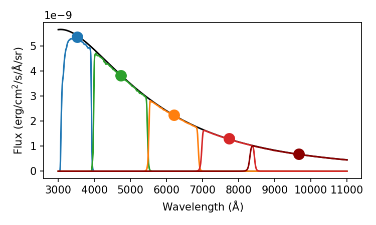

## Flux and Magnitudes

### Apparent Magnitude
The term apparent magnitude comes from Hipparchus, who catalogued the visible stars. He assigned the brightest stars a magnitude of 1, and the faintest stars as a magnitude of 6. So, what does a magnitude actually represent?

Assume we know the distance, $D$, to a star that has an intrinsic luminosity, $L$. This luminosity will be distributed over the surface area of a sphere, so the flux, $F$ a telescope at Earth will measure is given by
$$
    F=\frac{L}{4 \pi D^2}
$$
Normally astronomers don't quote fluxes, but instead work in magnitudes. The conversion is
$$
m=-2.5\log_{10}\left(\frac{F}{C}\right)
$$
where C is a normalising constant. Now, consider an an object which is 100 brighter than another object ($F_2=100F_1$). If we calculate $m_1-m_2$, we find that it is 5. This means that an object which is 100 times brighter will have a magnitude which is 5 less - the magnitude system is an inverted scale (the more positive a magnitude is, the fainter it is).

The Sun has a magnitude of -27, while the faintest objects observable in the night sky have a magnitude of $\sim$ +30. The naked eye can see as faint as magnitude $+6$ if conditions are exceptional. **Apparent magnitudes** are typically written as $m$.

### Vega system
So how is the normalising constant in the above equation determined? Hipparchus had a pretty simple solution - he set the apparent magnitude of the star Vega to be 0. Hence, the difference in magnitudes between any star and Vega is given by
$$
\begin{align}
m_{\rm star}-m_{\rm Vega}&=-2.5\log_{10}\left( \frac{F_{\rm star}}{F_{\rm Vega}}\right) \\
m_{\rm star}-0&=-2.5\log_{10}\left( \frac{F_{\rm star}}{F_{\rm Vega}}\right) \\
m_{\rm star}&=-2.5\log_{10}\left( \frac{F_{\rm star}}{F_{\rm Vega}}\right) \\
\end{align}
$$
This gives that the constant in the equation should just be the measured flux from Vega. However, there's a slight problem with this system.

**Observing Filters**
If we measured the flux ($F=\int_0^{\infty} F_{\rm \lambda} d\lambda$) coming from a star across the entire electromagnetic spectrum, the magnitudes we calculate are called **bolometric magnitudes**. This is a very difficult quantity to measure (for various reasons, including Earth's atmosphere absorbing a lot of incoming radiation and the difficulties in detecting particular wavelengths of light).

Instead stars are typically observed using different filters, which cover different parts of the spectrum. The below figure shows the sensitivity curves ($S$) for the SDSS (Sloan Digital Sky Survey) filters.

These transmission curves tell us which part of the spectrum we are sensitive too when using them. For example, when using the $u$ filter, we are sensitive to light from $\sim 3000-4000$ Å. 

As such, the u-band magnitude of the source, $m_u \equiv u$, is given by 

$$
    u=-2.5\log_{10}\left(\frac{\int_0^{\infty} S_u F_{\rm \lambda} d\lambda}{C_u}\right)\\
    u=-2.5\log_{10}\left(\int_0^{\infty} S_u F_{\rm \lambda} d\lambda\right)+C_u
$$

Here, $C_u$ is a constant for the u band filter. Similar constants ($C_g$,$C_r$,$C_i$,$C_z$) exist for each band ($g$,$r$,$i$,$z$).

Let's now return to the problem of determining these constants, by again considering the Vega system. Vega is a type A0V star with a surface temperature of ~9500 K (varying between the poles and the equator). The blackbody spectrum of a 9500 K star is shown below, split up into the 5 filters discussed above.

The integrated flux ($\int_0^{\infty} S_u F_{\rm \lambda} d\lambda$) of Vega in each of these filters is $F_{\rm u}=4.18\times10^{-09} \rm {\: W \: / m^2}$, $F_{\rm g}=5.71\times10^{-09} \rm {\: W \: / m^2}$,  $F_{\rm r}=3.09\times10^{-09} \rm {\: W \: / m^2}$,  $F_{\rm i}=1.91\times10^{-09} \rm {\: W \: / m^2}$, and $F_{\rm z}=4.18\times10^{-09} \rm {\: W \: / m^2}$ - that is, the constant changes depending on which band you are focusing on because the spectrum of Vega varies with wavelength. Note that I've presented the constants here as if you are measuring the flux per filter. Often, astronomers work in flux densities (either per unit wavelength or per unit frequency) as this number is more easily comparable across different filters. But this comes with it's own challenges, as frequency and wavelength are inversely proportional, so moving between them can cause confusion. Also note that the constants I've calculated above will differ from the correct ones - this is because the spectrum of Vega is much more complicated that that of a black body due to the presence of absorption lines and a varying surface temperature.

There is a more logical system which does not rely on the spectrum of a star. In the **AB** system, which the SDSS filters traditionally use, the constants are chosen such that a star with magnitude 0 has a flux density of 3.631$\times10^{-20}$ erg cm$^{-2}$ s$^{-1}$ Hz$^{-1}$ - that is, the spectrum in terms of frequency is flat. This is nice because as long as you are working in units of flux density per unit frequency, the constant is always the same. However, when you move to working in flux density per unit wavelength, the frequency follows a $\frac{1}{\lambda^2}$ behaviour because of the previously mentioned conversion, so it really only works nicely if you're working in flux density of per unit frequency (which most modern astronomers do!).

# Optics and Telescopes
> [!tip] What's the minium distance between two objects which can individually resolved, and how do optical telescopes work?

There are a few key phrases that get used when discussing telescope design that are useful to define. First, we have the focal length ($F$), which is the distance from a lens to where an image is created. Second, we have the diameter of a lens, $D$.

Now imagine we have 2 stars that are separated by an angle of $\theta$ on the sky, and a distance $d$ at the focal plane.

If we define the plate scale to be $s$ and that its units should be arcsec/mm, then the relation to $\theta$ and $d$ is
$$
    \theta[{\rm arcsec}] = s[{\rm arcsec}/ {\rm mm}] \: \: d[ {\rm mm}]
$$
Using the small angle approximation, we have that
$$
    \theta[{\rm rad}] = \frac{d}{F}
$$
Converting $\theta$ from radians to arcsec and combining with the above gives that
$$
    s[{\rm arcsec}/ {\rm mm}] = \frac{206.265}{F[{\rm m}]}.
$$

 Often photographers refer to the focal ratio, $f$, which is $F/D$. If we fix $F$ , the image scale remains the same. For a smaller $D$, less light is spread over the same area; the image gets dimmer. We would have to expose for longer to get the same amount of light in a given area. Therefore, large values of $f$ imply slow telescopes, and vice-versa.