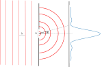
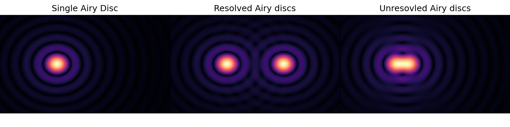
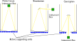

# Optics and Telescopes
> [!tip] What's the minium distance between two objects which can individually resolved, and how do optical telescopes work?

There are a few key phrases that get used when discussing telescope design that are useful to define. First, we have the focal length ($F$), which is the distance from a lens to where an image is created. Second, we have the diameter of a lens, $D$.

Now imagine we have 2 stars that are separated by an angle of $\theta$ on the sky, and a distance $d$ at the focal plane.

If we define the plate scale to be $s$ and that its units should be arcsec/mm, then the relation to $\theta$ and $d$ is
$$
    \theta[{\rm arcsec}] = s[{\rm arcsec}/ {\rm mm}] \: \: d[ {\rm mm}]
$$
Using the small angle approximation, we have that
$$
    \theta[{\rm rad}] = \frac{d}{F}
$$
Converting $\theta$ from radians to arcsec and combining with the above gives that
$$
    s[{\rm arcsec}/ {\rm mm}] = \frac{206.265}{F[{\rm m}]}.
$$

 Often photographers refer to the focal ratio, $f$, which is $F/D$. If we fix $F$ , the image scale remains the same. For a smaller $D$, less light is spread over the same area; the image gets dimmer. We would have to expose for longer to get the same amount of light in a given area. Therefore, large values of $f$ imply slow telescopes, and vice-versa.
## Fraunhofer diffraction
Recall from your optics lecture that a wave with wavelength $\lambda$ which passes through a slit of width $a$, where $a$>>$\lambda$, will produce a pattern given by:
$$
    I = I_0 \frac{\sin^2(\frac{\pi a \sin(\theta)}{\lambda})}{\left[\frac{\pi a \sin(\theta)}{\lambda}\right]^2}
$$
This is shown in the below figure. This pattern has recurring minima at $\sin\theta=\frac{m\lambda}{a}$ where m is an integer. *(Aside: The interesting thing here is to think about what the mathematical relationship between the slit (which is a boxcar function) and the intensity is. The Fourier transform of a boxcar is a sinc, and our function is a sinc$^2$. This is a branch of optics known as Fourier optics, which allows us to use Fourier methods to establish what various optical elements are doing.*

If the slit is 2 dimensional, like the aperture of a telescope, then the pattern produced is this function rotated around its axis, and is called an Airy Disc. In this case, the difference between the minima can still be given by $\sin\theta=\frac{m\lambda}{a}$, but m is no longer integer. The first minimum occurs when $m=1.22$ (the derivation is tough and beyond the scope of this module).

So, if we have 2 sources in our image, they will both produce Airy Discs. In order to not have their primary peaks overlapping, we want their angular separation to be:
$$
\sin\theta>\frac{1.22\lambda}{a}
$$
or, for small angles
$$
\theta>\frac{1.22\lambda}{a}.
$$
This is the Rayleigh criteria, and is very important when considering what wavelength to observer your source at.

> [!example] Example: A 10m optical telescope
> For a 10m aperture optical telescope (observing at $\lambda=5000$Å) we find that    
>$$
>   \theta=\frac{1.22\times0.5\mu m}{10m}=0.01{\rm''}
>$$
>Again, this is much smaller than the seeing we're used because of Earth's atmosphere. As such, it makes sense to put optical telescopes into space where they can make full use of their resolution. For example, consider the HST. It's mirror is 2.5 meters in diameter so $\theta=0.05{\rm''}$.

# Telescope Designs

## Refractors
The first telescopes used lenses to focus starlight. While they were dominant in astronomy from centuries, they come with certain limitations. Mainly:
1. The refractive index of the lens is wavelength dependent, meaning bluer wavelengths would be focused at a different point then redder wavelengths (see below). This chromatic aberration can be minimised by placing the detector at the circle of least confusion (see below) or by adding corrector lenses behind the mirror - but this is expensive and requires incredibly precision.
2. The mirrors are heavy and distort when not pointing directly upwards.
3. Their size does not scale well. If you want a high resolution image, you must increase the focal length of your telescope - but in order to keep the telescope "fast", you also need to increase the diameter of your mirror. This means that even modest sized refractors have very long focal lengths - which means the telescopes are massive, and the domes vast chambers (also see below). For example, the largest refractor ever built (the Yerkes telescope, 1897) is a 1 meter diameter telescope with a 19.3 meter focus - but the dome required to house it is 27 meters in diameter.

![[Yerkes.jpg]]
# Reflectors
Towards the end of the 19th century, reflecting telescopes began to become very popular due to several breakthroughs in increasing the reflectivity of mirrors and reducing the upkeep required on them. They are not without their own flaws - the chief one being that the mirror must be parabolic rather than spherical, and parabolic mirrors require incredible precision (for example, HST was sent up with a bad mirror that led to horrible spherical aberration which needed to be corrected by STS-61).

![[HST.gif]]

All modern telescopes used for science are reflectors - but as opposed to refractors (where you can only really have the eye piece/instruments) at the end of the tube, reflectors can have different designs and different numbers of mirrors. Below I show three of the most popular.

1. The prime focus telescope has a single mirror which focuses light at a point close to the top of the telescope. It's relatively cheap in that you only need one mirror, but access to the instrument box is difficult (and used to lead to astronomers spending the entire night in the cage).
2. The Newtonian uses a flat mirror close to the top of the tube to pick off the focused starlight and send it out to a focus on the side of the telescope. This is definitely better than the prime focus as it allows for *slightly* easier access to the instruments, but it leads to weight and balance issues on very large telescopes with very heavy instruments.
3. The Cassigrian uses a small secondary mirror to send light back down through a hole in the primary mirror. This is great as the instruments are easily accessible and the telescope suffers less balance issues (but does mean you have a hole in your telescope), but the field of view isn't particularly large (and there are still issues with targets that are significantly off axis).
![[Hale_Cage.jpg]]

You can also add more mirrors to the Cassigrian design to pick off light and send it to instrument boxes on either side of the telescope. These folded Cass designs are very common on large telescopes as it means you can have multiple instruments mounted at once, and switching between them requires only moving one mirror. You can see a complicated example of a folded Cass design in this video for the [ELT](https://youtu.be/aqfLGrpOjjY). You can also combine lenses and mirrors (Schmidt-Cassegrian telescopes) or use two hyperbolic mirrors (Ritchey-Chretien reflectors).