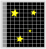

# Telescope Mounts
There's one final aspect of an optical telescope which I want to cove before moving on. If you see any telescope built prior to the 1980s, the telescope is on an equatorial mount. The below is a schematic of such a mount (credit: Stuart Littlefair).

![[Equatorial.png|200]]
These mounts are tilted such that one rotational access parallel to the rotational axis of the Earth (that is, it points towards the celestial pole) while the other axis is perpendicular to the rotational axis. This setup allows for very easy acquisition of a star, as if you know the declination of the star, you just set the telescopes declination to be the same, and then rotate the R.A. axis until you find your star. It's also very easy to track the star as the Earth rotates, as you just need to rotate the right ascension axis in order to follow it.

However, these mounts need large, heavy counterweights to keep the telescope tube in balance, and the domes required for them are very large in order to have space for the mount, tube, and counterweight. [The Hale telescope](https://sites.astro.caltech.edu/palomar/about/telescopes/hale.html) is a 5m telescope, but requires a Dome which is 41 m tall and 42 m in diameter.

A more compact mount is the Alt-Az mount. For these telescopes, one rotational axis is parallel to the Earth's surface at your observing site, while the other points directly towards the Zenith. The reason such mounts didn't become widely adopted until after the 1980's is that, in order to track a star at constant declination, the telescope must be rotated in both altitude and azimuth - and doing the conversion between changing R.A. and changing Alt/Az quickly requires a computer. Now, most research-grade telescopes are Alt-Az mounts. For example, [ESO's VLT](https://www.eso.org/public/images/potw1036a/) are 10m telescope which only need domes that are 30 m tall and 28 m in diameter.
# Detecting light
# CCD's (outdated, SCMOS detectors taking over!)
The human eye has a very low quantum efficiency (QE) of about 1% (this means around 1 in every 100 photons is actually detected). At optical wavelengths, we typically use CCDs, or charged-coupled devices, for observations. This is due to their very high quantum efficiency, meaning their response is nearly linear - that is, the number of counts you observe is directly proportional to the intensity of light.

They also have very high dynamic ranges - each pixel in a CCD is capable of registering up to ~65,000 counts accurately. Typically, CCD's are Si based. As a photon interacts with a given pixel, it causes excitation of an electron into a conduction band. When finished observing, the accumulation of charge within a pixel can be shifted to an adjacent pixel. As such, an image is read out pixel-by-pixel, as shown below.

The expected number of photons reaching our detector over a fixed interval of time is $N$, but the arrival time of each photon is randomly distributed. This means we should get some variation in the number of photons we detect in sequential time intervals. The probability of detecting $k$ photons over a fixed time interval is then given by a Poisson distribution
$$
    P(k)=\frac{N^k e^{-N}}{k!}
$$
where $k$ is an integer (because we can't detect half a photon!) but $N$ can be non-integer. This is a probability distribution, meaning we require that
$$
\sum_{k=0}^{\infty}P(k,N)=1
$$
It is easy enough to show that for such a distribution, the standard deviation is given by $\sigma=\sqrt N$ and that the mean value for $\left<k\right>=N$. As the expected number of photons, $N$, grows (by increasing aperture size or exposure time), the standard deviation grows at a slower rate.

Now imagine we wish to measure the signal-to-noise(SNR) ratio of a star. This is given by:
$$
    {\rm SNR} = \frac{Signal}{Noise}=\frac{N}{\sigma}=\sqrt{N}
$$
This equation only holds true if the only source of noise is due to the statistical fluctuations in the number of photons between exposures. However, when dealing with CCD detectors, we normally have:
- The noise due to $S_0$ photo-electrons from the source, $\sigma_0=\sqrt S_0$
- The noise due to $S_b$ photo-electrons from the background, $\sigma_b=\sqrt S_b$
- The noise due to $S_d$ electrons caused by the thermal properties of the CCD, $\sigma_d=\sqrt S_d$.
- A time independent readout out noise, $\sigma_R=R$. This is not a square root, and is the standard deviation in the number of electrons measured at the readout step.

Let's assume all of these processes are independent, which allows us to say that the variance of the sum is the sum of the variances, $\sigma_{\rm Total}^2 = \sigma_0^2+\sigma_b^2+\sigma_d^2+\sigma_R^2$. As such, the noise term, $N=\sigma_{\rm Total}$, is given by
$$
    N = \sqrt{S_0+S_b+S_d+R^2}
$$
and thus the Signal-to-Noise ratio is given by
$$
    {\rm SNR} = \frac{S_0}{\sqrt{S_0+S_b+S_d+R^2}}.
$$
This is the most basic form of this equation, but it can become significantly more complicated. This is because the equation uses the number of electrons liberated in a pixel by incoming photons (which isn't necessarily a 1-1 conversion), while normally we have an estimate of the number of photons which we are expecting to arrive at our detector. Also, the total number of photons from the source are normally spread over several pixels, but the background is normally reported as photons/pixel - meaning you'd need to multiple $N_{b}$ by the number of pixels which $N_0$ is spread over to get the units right.

There are 3 limiting cases for the basic form of the equation.

1. **Object limited: $S_0 >> S_b,S_d,R^2$**.
    In this case, the equation simplifies to ${\rm SNR}=\frac{S_0}{\sqrt S_0}=\sqrt {S_0}$. Since the number of counts detected, $S_0$, is proportional to time, then SNR $\propto \sqrt{t}$. This means you eventually get diminishing returns on increasing your exposure time. Additionally, $S_0$ is proportional to $D^2$, where D is the aperture of the telescope. As such, SNR $\propto D$.
2. **Background limited: $S_b >> S_0,S_d,R^2$**
    In this case, we get  ${\rm SNR}=\frac{S_0}{\sqrt S_b}$. Both $S_0$ and $S_b$ scale the same way with exposure time and telescope aperture, and the SNR scales the same as in the above. For fixed $S_0$, the SNR scales with the square root of the background signal - so if your background increases (because for example the moon rises), the SNR drops. This is important in determining when to observer your targets - can they withstand a bright moon, or do you need no moon at all?
3. **Read noise limited: $R^2 >> S_0,S_b,S_d$**
    Read noise is independent of exposure time, so this typically only occurs for short exposures. ${\rm SNR}=\frac{S_0}{R}$. In this regime, since $R$ is time independent, SNR scales linearly with time and with the square of the aperture.