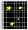

# Detecting light
## CCD's (outdated, SCMOS detectors taking over!)
The human eye has a very low quantum efficiency (QE) of about 1% (this means around 1 in every 100 photons is actually detected). At optical wavelengths, we typically use CCDs, or charged-coupled devices, for observations. This is due to their very high quantum efficiency, meaning their response is nearly linear - that is, the number of counts you observe is directly proportional to the intensity of light.

They also have very high dynamic ranges - each pixel in a CCD is capable of registering up to ~65,000 counts accurately. Typically, CCD's are Si based. As a photon interacts with a given pixel, it causes excitation of an electron into a conduction band. When finished observing, the accumulation of charge within a pixel can be shifted to an adjacent pixel. As such, an image is read out pixel-by-pixel, as shown below.

The expected number of photons reaching our detector over a fixed interval of time is $N$, but the arrival time of each photon is randomly distributed. This means we should get some variation in the number of photons we detect in sequential time intervals. The probability of detecting $k$ photons over a fixed time interval is then given by a Poisson distribution
$$
    P(k)=\frac{N^k e^{-N}}{k!}
$$
where $k$ is an integer (because we can't detect half a photon!) but $N$ can be non-integer. This is a probability distribution, meaning we require that
$$
\sum_{k=0}^{\infty}P(k,N)=1
$$
It is easy enough to show that for such a distribution, the standard deviation is given by $\sigma=\sqrt N$ and that the mean value for $\left<k\right>=N$. As the expected number of photons, $N$, grows (by increasing aperture size or exposure time), the standard deviation grows at a slower rate.

## The signal-to-noise ratio
Now imagine we wish to measure the signal-to-noise(SNR) ratio of a star. This is given by:
$$
    {\rm SNR} = \frac{Signal}{Noise}=\frac{N}{\sigma}=\sqrt{N}
$$
This equation only holds true if the only source of noise is due to the statistical fluctuations in the number of photons between exposures. However, when dealing with CCD detectors, we normally have:
- The noise due to $S_0$ photo-electrons from the source, $\sigma_0=\sqrt S_0$
- The noise due to $S_b$ photo-electrons from the background, $\sigma_b=\sqrt S_b$
- The noise due to $S_d$ electrons caused by the thermal properties of the CCD, $\sigma_d=\sqrt S_d$.
- A time independent readout out noise, $\sigma_R=R$. This is not a square root, and is the standard deviation in the number of electrons measured at the readout step.

Let's assume all of these processes are independent, which allows us to say that the variance of the sum is the sum of the variances, $\sigma_{\rm Total}^2 = \sigma_0^2+\sigma_b^2+\sigma_d^2+\sigma_R^2$. As such, the noise term, $N=\sigma_{\rm Total}$, is given by
$$
    N = \sqrt{S_0+S_b+S_d+R^2}
$$
and thus the Signal-to-Noise ratio is given by
$$
    {\rm SNR} = \frac{S_0}{\sqrt{S_0+S_b+S_d+R^2}}.
$$
This is the most basic form of this equation, but it can become significantly more complicated. This is because the equation uses the number of electrons liberated in a pixel by incoming photons (which isn't necessarily a 1-1 conversion), while normally we have an estimate of the number of photons which we are expecting to arrive at our detector. Also, the total number of photons from the source are normally spread over several pixels, but the background is normally reported as photons/pixel - meaning you'd need to multiple $N_{b}$ by the number of pixels which $N_0$ is spread over to get the units right.

There are 3 limiting cases for the basic form of the equation.

1. **Object limited: $S_0 >> S_b,S_d,R^2$**.
    In this case, the equation simplifies to ${\rm SNR}=\frac{S_0}{\sqrt S_0}=\sqrt {S_0}$. Since the number of counts detected, $S_0$, is proportional to time, then SNR $\propto \sqrt{t}$. This means you eventually get diminishing returns on increasing your exposure time. Additionally, $S_0$ is proportional to $D^2$, where D is the aperture of the telescope. As such, SNR $\propto D$.
2. **Background limited: $S_b >> S_0,S_d,R^2$**
    In this case, we get  ${\rm SNR}=\frac{S_0}{\sqrt S_b}$. Both $S_0$ and $S_b$ scale the same way with exposure time and telescope aperture, and the SNR scales the same as in the above. For fixed $S_0$, the SNR scales with the square root of the background signal - so if your background increases (because for example the moon rises), the SNR drops. This is important in determining when to observer your targets - can they withstand a bright moon, or do you need no moon at all?
3. **Read noise limited: $R^2 >> S_0,S_b,S_d$**
    Read noise is independent of exposure time, so this typically only occurs for short exposures. ${\rm SNR}=\frac{S_0}{R}$. In this regime, since $R$ is time independent, SNR scales linearly with time and with the square of the aperture.

## The Bayes equation
Next we are going to look at how to determine whether some data could possibly have been drawn from a proposed model. First, we need to recap some basic probability. Imagine I have two events, $A$ and $B$, which are not correlated. The probability of either event happening is
$$
P(A {\rm \: or \:} B)= P(A)+P(B)
$$
The probability that both events will happen (if they are exclusive, in that they both can't happen at once) is
$$
P(A {\rm \: , \:} B)= P(A)\times P(B)
$$
However, if the events are not exclusive (that is, both events could happen at once), the condition becomes
$$
P(A,B) =P(A|B)P(B)=P(B|A)P(A)
$$
where the notation $P(A|B)$ means the probability of $A$ happening given $B$ happens. Re-arranging this equation we get
$$
P(B|A) = \frac{P(A|B)P(B)}{P(A)}
$$
This is the Bayes' equation, and we'll make use of it in the next lecture.
# Errors and their meaning
When a report presents a result for a variable $x$ as $x\pm\sigma$, what does the $\sigma$ actually represent? This is an important question, especially since you are constantly being ask and reminded to present results with errors included.

Without explicitly defining $\sigma$, it is impossible to know how you should interpret the error - which is why you always need to say what it represents. Normally, an error bar is a convenient way of representing the probability distribution function $p(x)$. Commonly this probability distribution function is Gaussian, which has the form
$$
P(x) = \frac{1}{\sqrt{2\pi\sigma^2}}\exp\left[{-\frac{1}{2}\left( \frac{x-\mu}{\sigma} \right)^2}\right]
$$
where this distribution has a central value of $\mu$ and standard deviation of $\sigma$.

## Fitting data
Imagine now we have some data and we wish to fit a model to it. How do we judge whether the model is a good fit to the data? The first question to ask is "Given some model, what is the probability the data I have were drawn from it?". Using the convention from earlier in the lecture, this would be $P(D|\theta)$ where $D$ is the data and $\theta$ is the model I am considering. For a single data point, $y_i$, and assuming my data has a gaussian error of $\sigma_i$, the above equations combine to give 
$$
P(y_i | \theta) = \frac{1}{\sqrt{2\pi\sigma_i^2}}\exp\left[{-\frac{1}{2}\left( \frac{y_i-y(\theta)}{\sigma_i} \right)^2}\right]
$$
where $y(\theta)$ is the y value which our model predicts. If I have $N$ datapoints, then $P(D|\theta)$ becomes
$$
P(D|\theta)=\prod_{i=1}^{N}P(y_i | \theta)=\prod_{i=1}^{N}\left(\frac{1}{\sqrt{2\pi\sigma_i^2}}\exp\left[{-\frac{1}{2}\left( \frac{y_i-y(\theta)}{\sigma_i} \right)^2}\right]\right)
$$
Simplifying gives
$$
P(D|\theta)=\prod_{i=1}^{N}\left(\frac{1}{\sqrt{2\pi\sigma_i^2}}\right)\prod_{i=1}^{N}\left(\exp\left[{-\frac{1}{2}\left( \frac{y_i-y(\theta)}{\sigma_i} \right)^2}\right]\right)
$$
Taking the natural log then gives
$$
\begin{align}
\ln(P(D|\theta))&=\ln\left(\prod_{i=1}^{N}\left(\frac{1}{\sqrt{2\pi\sigma_i^2}}\right)\right)+\ln\left(\prod_{i=1}^{N}\left(\exp\left[{-\frac{1}{2}\left( \frac{y_i-y(\theta)}{\sigma_i} \right)^2}\right]\right)\right)\\
\ln(P(D|\theta))&=\alpha+\ln\left(\exp\left(-\frac{1}{2}\sum_{i=1}^{N}\left[{\left( \frac{y_i-y(\theta)}{\sigma_i} \right)^2}\right]\right)\right)\\
\ln(P(D|\theta))&=\alpha-\frac{1}{2}\sum_{i=1}^{N}\left[{\left( \frac{y_i-y(\theta)}{\sigma_i} \right)^2}\right]\\
\ln(P(D|\theta))&=\alpha-\frac{1}{2}\chi^2\\
\ln(\mathcal{L})&\propto-\chi^2\\
\end{align}
$$
where $\alpha$ is some model-independent constant that we don't care about, and we've defined the $\chi^2=\sum_{i=1}^{N}\left[{\left( \frac{y_i-y(\theta)}{\sigma_i} \right)^2}\right]$.  I've also replaced $P(D|\theta)$ with it's more common sign of $\mathcal{L}$, and which is most often call the likelihood.

This is a really simple metric to evaluate for a given model, and we can now see that if I minimise my $\chi^2$ value by changing my model parameters, I am also maximising the  likelihood of my model.