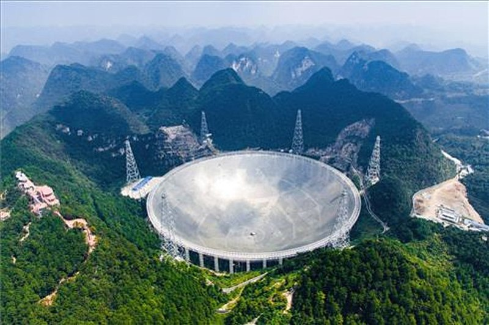

# Infrared Astronomy

Recall Wien's displacement law, which states that
$$
\lambda T={\rm constant}=2898 {\rm \: \mu m\:K}
$$
Stars with a temperature of 2500 Kelvin will peak in intensity at a wavelength of 1.2 microns. So if we want to observed the coolest stars (M-dwarfs), around which we've found a lot of exoplanets (which are also very cold objects), then we need to move to infrared wavelengths. This region is also where we're likely to see the optical spectra of highly redshifted Galaxies, making this a very important window for astronomy.

One of the largest issues comes from the thermal radiation produced by the sky and the telescopes themselves. IR instruments are typically cooled to minimise these effects, normally with liquid He. This of course means they have limited lifespans - the helium on the Spitzer space telescope lasted for 5 years.

1-5 $\mu$m observations can be done from the ground, but above this, it is much better to go to space (especially > 25 $\mu$m).

IR astronomy comes with one other major advantage over optical astronomy. The effects of interstellar extinction are far weaker at IR wavelengths than at optical wavelengths.

Typically, when discussing interstellar extinction, a value is given as $A_{\rm V}$ . This represents the magnitude of light absorbed due to interstellar extinction in the Johnson V band. So $A_{\rm V}=5$ means 5 mags are absorbed at V band, and so an object will appear 100 times fainter in the night sky than it should. The below figure shows extinction as a function of wavelength - it is stronger at shorter wavelengths, meaning it affects optical astronomy quite significantly.

Very roughly, there is a linear dependence on $A_{\rm V}$ with distance, with $A_{\rm V}=1$ corresponding to a rough distance of 1 kpc.

 >[!example] Example: A star with $A_{\\rm V}=10$
>Imagine we are observing a star through a dust cloud, and that $A_{\\rm V}=10$ mag. The extinction at K band (which is at 2 $\mu$m) would be:
>$$
>\frac{A_{\rm K}}{A_{\rm V}}=0.1253303 
>$$
>$$
>A_{\rm K}=10\times0.1253303=1.2
>$$
>So there's only 1.2 mags of extinction at the K band. Now if we assume that the object is equally bright in both V and K bands, that means the object is ~ 3000 brighter in the K band than in the V band!

# Radio Astronomy
Karl Jansky observed the first radio waves coming from our Galaxy, when he found evidence for periodic radio emission. He first thought it was from the Sun, but after several months of observations, he found the period to be 23 hr and 56 min, and was coming from the centre of the Milky Way.

The strength of radiation from a radio source is typically given by the Spectral Flux Density, $S(\nu)$, and normally has units of Jy (1 Jy = $1\times10^{-26}$ W/m$^2$/Hz). This turns out to be a very bright unit. The most common astrophysical sources are typically in the mJy to $\mu$Jy range.

Imagine a telescope has efficiency of $f(\nu)$ at $\nu$. The power received by the telescope from a source is then given by
$$
P=\int_A \int_\nu S(\nu)f(\nu) d\nu dA
$$

where A is the collecting area of your telescope.

If $S(\nu)$ is constant over the frequency range of interest $\Delta\nu$, and if our efficiency is 1, then
$$
P=S \: A \: \Delta \nu \: (\rm Watts)
$$
which is a very simple formula for calculating the expected power at your receiver. So what sort of collecting areas do we expect?

As discussed when  we encountered the Rayleigh Criteria, if we are observing at radio wavelengths, the angular resolution of a relative large dish is not very high. For example, observations at $\lambda = 5 {\rm \: cm}$ with a 10 meter dish, then the angular resolution of the telescope is $0.3^{\rm o}$. So in order to get high resolution images from radio telescopes, they need large diameters.

Fortunately, this is possible to do - the accuracy a mirror requires to effectively reflect a wavelength scales as $\sim \lambda/4$ - so for observations taken at 5 cm, your mirror can have defects as large as 1cm. For example, FAST (the Five hundred Meter Aperture Spherical telescope) has an angular resolution of 25 arcsec. The problem with such telescopes is you can't point them (but you can move your focus to pick off subsets of the mirror).

## Interferometry

Let's consider the Rayleigh criteria from the last lecture again. Assuming an observing wavelength $\lambda=10 {\rm \: cm}$, and a dish with diameter 50m. The resolution of such a telescope is  roughly 8 arcmins.

Consider two radio dishes, separated by a distance L, and joined by a correlator. The path difference between the two telescopes for incoming photons, $c \Delta t$, is given by $c \Delta t=L\sin(\theta)$. Because of this path difference, the photons arriving at the two dishes are out of phase with each other. By design or through use of time delay, we can ensure that $c \Delta t=n \lambda$, where $n$ is an integer. As such, the photons arriving at telescope 1 and 2 can be constructively interfered. This then means that $n \lambda = L\sin(\theta)$. At this stage, the entire setup becomes analogous to Young's Double Slit experiment.

Now imagine we are interested in another source offset from the original source by a small angle $\Delta \theta$. The difference between the time delays for the 2 sources, $c \Delta t$, is given by $c \Delta t \sim L\Delta \theta$. 

In order for the photons to constructively interfere again, and for us to see a maximum in intensity in our interference pattern, the change in the path length must at least $c \Delta t \sim \lambda$ - if it is less, the photons will not. Thus, in order to see another peak in the interference pattern, the minimum angular distance is given by  $\Delta \theta \sim \frac{\lambda}{L}$.

This gives the approximate resolution of a interferometer. If $L$ is large, then $\Delta \theta$ is very small.
   
   >[!example]  Very Long Baseline Interferometry (VLBI)
   Imagine we had 2 dishes separated by the diamter of the Earth, and observing at 10cm. The resolution of the combined dishes would be $1.6\times10^{-3}$ arcseconds!

