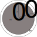

## The Jeans Mass
When the total energy of a cloud (kinetic+potential) is less than 0, the cloud can be considered bound.
$$
    E_{kinetic}+E_{\rm GP}<0
$$
or
$$
    E_{kinetic}<|E_{\rm GP}|
$$
The kinetic energy of each particle is $\frac{3}{2}kT$, so for N particles in a cloud, the kinetic energy of the cloud is
$$
    E_{kinetic}=\frac{3}{2}NkT
$$
The expression for the gravitational potential energy of the cloud is given by $\frac{GM^2}{R}$. Balancing these,we get
$$
    M>\frac{3kT}{2G\bar{m}}R
$$
where $\bar{m}$ is the average mass of the particles in the cloud. Thus, a cloud will collapse if it's mass exceeds this quantity, which is known as the **Jeans Mass**
$$
    M_{\rm J} = \frac{3kT}{2G\bar{m}}R
$$
This can also be expressed in terms of density as 
$$
    \rho_{\rm J} = \frac{3}{4 \pi M^2}\left[\frac{3kT}{2G\bar{m}}\right]^3
$$
That is, a cloud of mass $M$ will collapse if it's density exceeds $\rho_{\rm J}$.

The Jeans density for a cloud of 300 solar masses, made entirely of molecular Hydrogen, and with a temperature of 20 Kelvin, is:
$4.28\times10^{-21}$ kg / m3  (mass density).
$1.2\times10^6$ / m3 (particle density).

The Jeans density for a cloud of 1 solar masses, made entirely of molecular Hydrogen, and with a temperature of 20 Kelvin, is:
$3.85\times10^{-16}$ kg / m3  (mass density).
$1.15\times10^{11}$ / m3 (particle density).

Using the Jeans Density, we found that for a 300 solar mass cloud, a density of $1\times 10^6$ particles/m$^3$ is enough to drive a collapse. Clouds with this density typically follow a hierarchical collapse. In this model, one large cloud begins to collapse, driving up the density at various parts of the cloud until the cloud separates into smaller clouds, with densities high enough to cause gravitational collapse. This process continues until a single cloud produces several stars.
# Free fall time
The free fall time is the timescale required for collapse ignoring pressure. Consider a collapse from a starting radius, $r_0$, to a radius $r$, by a shell of mass $\Delta m$, and which encloses a total mass $m_0$ (and where $m_0$ does not change during the collapse) as shown below.

By conserving kinetic and potential energy, the velocity of the shell as it reaches a radius of $r$ is given by
$$
    \frac{1}{2} \left(\frac{dr}{dt}\right)^2=\frac{Gm_0}{r}-\frac{Gm_0}{r_0}
$$
The free fall time is then given by
$$
t_{\rm FF} = \int^0_{r_0} \frac{dt}{dr} = -\int^0_{r_0} \left[ \frac{2Gm_0}{r}-\frac{2Gm_0}{r_0}\right]^{1/2} dr.
$$
By letting $x=r/r_0$, and using the expression 
$$
    \int^1_0 \left(\frac{x}{1-x}\right)^{1/2} dx=\pi/2
$$
we get that
$$
    t_{\rm FF} = \left[\frac{3\pi}{32G\rho}\right]^{1/2}.
$$
So what does this actually tell us? Let's assume a density of $\rho=1$ Hydrogen atom/cm$^3$. Then we get a free fall time of $0.05 \: {\rm Gyr}$ (check this!)

This is pretty short compared to the age of the Galaxy. Also, ignoring pressure is not always a bad assumption - assuming that the internal energy within the cloud is lost as radiation, or absorbed into electrons transitioning between states, then the pressure within dust clouds can be kept very very low. Eventually, however, the cloud will become opaque to the radiation it is producing - at this point, we'll get a balance between in inward force of gravity and the outward force of pressure. This is known as Hydrostatic equilibrium.

## An adiabatic collapse
To relate our current problem to some of the concepts that were covered in thermodynamics last year, let's consider what happens if the cloud collapses adiabatically (that is, there is no exchange of heat with the surrounding environment). First, if we consider $M$ and $\bar{m}$ to be fixed, the temperature dependance on Jeans density is given by
$$
    T \propto \rho^{1/3}
$$
Now, imagine we have an ideal gas that is collapsing adiabatically. In such a scenario, the equation of state gives
$$
    T \propto \rho^{\gamma -1}
$$
where $\gamma$ is known as the adiabatic index. For a monatomic gas, $\gamma = 5/3$. The dependence of such a gas is shown in the below figure, and mainly highlights two behaviours. First, if a monatomic gas is initially located in the "contraction" phase of the diagram, it will slowly contract until it reachs the solid line - at which case, contraction ceases as the gas is in equilibrium. Alternatively, if a monatomic gas is in the "expansion" phase, it will expand until it reaches this equilibrium. This presents us with a problem, as it suggests that a monatomic gas will naturally cease expanding or contracting with relative ease, which is not conducive to star formation.

So what if instead $\gamma \leq 4/3$? In this case, such a gas will never cross that equilibrium line, which means a gas cloud that starts in the contraction region will continue to contract indefinitely, while a cloud in the expansion region will expand indefinitely. So then the question becomes - what sort of gas do we need such that $\gamma \leq 4/3$? Fortunately, this is trivial to do. If the cloud is not monatomic, or if all the hydrogen is either dissociated or ionized, then the adiabatic index is $\gamma \leq 4/3$.

![[Temp_density.png]]
# Hydrostatic Equilibrium
The formal condition for hydrotstatic equilibrium is
$$
    -\frac{d^2r}{dt^2}=0
$$
From this, we get
$$
    \frac{dP}{dr}=\frac{-Gm(r)\rho (r)}{r^2}
$$
By multiplying by $4\pi r^3$ and integrating from $r=0$ to $r=R$ we get
$$
    \int^R_0 4\pi r^3 \frac{dP}{dr} dr = \int^R_0 \frac{-4\pi G m(r)\rho (r) r^2}{r} dr
$$
The right hand side is the gravitational potential energy of the system ($E_{\rm GP}$), but the left is tricker, and needs to be integrated by parts to give
$$
    [P(r)4\pi r^3]^R_0-3\int^R_0 P(r) 4 \pi r^2 dr
$$
The first term is 0, as $P(r)=0$ at R (there is no pressure at the edge of the cloud). The second term is the same as $3
V$, where $
$ is the volume average pressure. Thus, we get
$$
    
 = -\frac{1}{3}\frac{E_{\rm GP}}{V}
$$
This is the **Virial theorem**. So now we have the condition for reaching hydrostatic equilibrium.