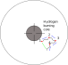

# A collapsing proto star
So let's assume we are at the final stage of this collapse - that is, we have a 1 solar mass dust cloud of molecular hydrogen at a temperature of 20 K, and an average density of:
$$
    \rho = \rho_{\rm J} = \frac{3}{4 \pi (1 {\rm M_{\odot}})^2}\left[ \frac{3k (20 {\rm K})}{2 G (2\times m_{\rm H})}\right] ^3
$$
The radius of such a cloud is $\sim 10^{15}$m. This cloud will collapse unopposed as long as the gravitational energy released is not converted into thermal motion of the particles. This will happen as long as the energy goes into disassociation of hydrogen molecules and the ionisation of H atoms.

## The radius at which pressure becomes important
So how small is the gas cloud when this happens? In order to estimate it, we need to know how much energy can go into dissociating and ionising H.

The energy to disassociated a H molecules is $\epsilon _D=4.5$eV, while the energy needed to ionise a H atom is $\epsilon _I=13.6$eV. As such, the energy needed to dissociate all of the H molecules, and ionise of the H atoms, is approximately
$$
    \frac{M}{2m_H}\epsilon _D+\frac{M}{m_H}\epsilon _I
$$
Assuming that this energy comes from the gravitational collapse of a cloud from $R_1$ to $R_2$, we can then equate these
$$
    \frac{GM^2}{r_2}-\frac{GM^2}{r_1}=\frac{M}{2m_H}\epsilon _D+\frac{M}{m_H}\epsilon _I
$$
If we plug in $10^{15}$m as the initial radius, and assume a 1 solar mass cloud, we find that $R_2\sim 10^{11}$m (or 0.6 AU), and that the free fall time is $\sim$ 100,000 years.

## The core temperature once free fall has been halted
So at this stage, the gravitational energy released by the collapse can no longer go into dissociating or ionising hydrogen. From this point onwards, any further contraction equates to an increase in temperature of the cloud, which (assuming an ideal gas) means the pressure increases, slowing the collapse. Our next step is to calculate the temperature at this stage. 

We are in hydrostatic equilibrium, so we can use the virial theorem:
$$
    
V = -\frac{1}{3} E_{\rm GP} = NkT
$$
to estimate the temperature. Now, $E_{\rm GP} \sim -\frac{GM^2}{r_2}$. As such, T is $\sim 60,000$ K.

This is below the temperature required to drive fusion $(\sim 10^{7})$ K, so the cloud must collapse further to become a star.

## Degeneracy Pressure

So, will all dust clouds collapse enough to create a high enough temperature to ignite fusion. The short answer is no, but to understand why we must start considering quantum mechanical effects.

We will start by assuming that there is a minimum total kinetic energy for a collection of electrons, and that this degeneracy occurs when the average distance between electrons becomes comparable to the De Broglie wavelength, $\lambda _{\rm DB} = h/p$ where $h$ is Planck's constant and $p$ is the momentum. The kinetic energy of a classical electron is $E_{\rm KE} = kT$, so the momentum is given by $p\sim \sqrt{2 m_{\rm e} kT}$ (please excuse the mixing of classical and quantum here, but we just want to get a rough handle on the picture). As such, the De Broglie wavelength is
$$
    \lambda_{\rm DB} = \frac{h}{\sqrt{2 m_{\rm e} kT}}
$$
So, a classical treatment of  the particles is appropriate when the distance between the electrons is much larger than this wavelength. Assume we have a gas of ionised particles of mass $\bar{m}$ and a density of $\rho = \frac{\bar{m}}{\Delta x^3}$ (that is, each particle occupies a volume of $\Delta x^3$). For a classical treatment, we need $\Delta x >> \lambda$. This is satisfied when:
$$
    \rho << \frac{\bar{m}}{\lambda ^3} = \bar{m} \frac{(2 m_{\rm e} kT)^{3/2}}{h^3}
$$

Now, using our expression for the gravitational potential energy ($E_{GP}$) and kinetic energy $E_{KE}$, and assuming hydrostatic equilibrium is achieved and maintained, then we can show that the temperature of the star increases as
$$
    kT=\frac{GM\bar{m}}{3R} \simeq G\bar{m}M^{2/3}\rho^{1/3}.
$$
As such, the temperature at the core will rise with $\rho^{1/3}$ as long as the inequality on $\rho$ holds.

So, what happens when we reach the critical density? By combining the above two expressions, we arrive at an expression which tells us what the temperature of the core will be when this happens:
$$
    kT \sim \left(\frac{G}{h}\right)^2 \bar{m}^{8/3} m_e M^{4/3}
$$
Around this temperature, the electrons become generate, and exert degeneracy pressure, halting collapse. So, if we want fusion to occur, we need the temperature at which this occurs to be greater than $1\times 10^7$ K. The above approximation predicts this should happen somewhere between 0.04 and 0.1 ${\rm M_{\odot}}$. A more detailed treatment shows this occurs when $M>0.06 {\rm M_{\odot}}$. So, for a dust cloud with an initial mass higher than this, the core temperature will get high enough to start fusion. 

Smaller than this, and electron degeneracy pressure will halt collapse before the temperature has gotten high enough to ignite. Such stars are called brown dwarfs, and produce very low luminosities, making them very hard to observer.

# The Stellar interior
Now, consider a photon which emerges from a nuclear burning core, as shown below. It encounters an atom at 1, interacts, and emerges at an angle, and moves to encounter another atom at position 2. This repeats until after atom 4. At this stage, the photon has travelled a long distance (summation of blue arrows), but relative to the core, has only moved slightly outwards (green arrow). After N number of interactions, it will finally escape into space - but how many interactions is this? And how long does it take?

First, let's assume a mean-free-path length, ${\bf l}$, which is the mean distance travelled between interactions. The distance $D$ travelled is the summation of the vectors ${\bf D}={\bf l}_1+{\bf l}_2+{\bf l}_3+...+{\bf l}_N$. Squaring this, we get
$$
    D^2=l_1^2+l_2^2+l_3^2+...+l_N^2+({\bf l}_1 \cdot {\bf l}_2 + {\bf l}_1 \cdot {\bf l}_3+...)
$$
Now, over a large number of steps, $N$, all of the dot products should cancel, assuming every step is random. Thus, we get
$$
    D^2=l_1^2+l_2^2+l_3^2+...+l_N^2
$$
and assuming that every step is approximately the same distance,
$$
    D^2=Nl^2
$$

Assuming a mean free path of 1 mm, and that the radius of the run is $7\times 10^8$ m, we find that a photon approximately undergoes $N=5 \times 10^{23}$ scatterings. The time between each scattering is approximately $l/c$, and so it takes light $\sim 50,000$ years to reach the surface. This also means the light we are seeing from the Sun is not a good indicator of what is currently going on in the core. More direct probes, like measuring the solar neutrino flux, can give us direct insight into the core.